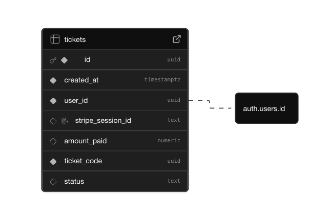

# Golden Tikkee

Event ticketing platform showcasing Supabase-authenticated checkout, Stripe payment flows with webhook fulfillment, and QR-coded tickets delivered via email and the in-app wallet.

## Quickstart

1. Visit `https://golden-tikkee.vercel.app`.

2. Sign up with your own email (needed to receive the QR ticket).

3. Complete checkout using the Stripe test card `4242 4242 4242 4242` (any future expiry, any CVC, any ZIP).

4. You will be redirected to a success page where you can view the receipt on `/success?session_id=...`.

5. Check your inbox for the QR ticket, see it in the home wallet, and review `/order_history` for your Stripe transaction.

## Core Features

- **Auth + guarded flows** - Supabase email/password (signup, confirm, reset) with `@supabase/ssr` cookies; checkout and wallet routes require sign-in.

- **Checkout + receipt validation** - Stripe Checkout for authenticated users; success page verifies the session ID before showing the receipt.

- **Webhook fulfillment** - Signature-verified Stripe webhook writes tickets to Supabase (RLS), generates QR codes, and emails them via Nodemailer + Gmail.

- **Ticket wallet + QR** - Carousel renders QR codes client-side with purchase metadata, status badges, and Stripe session references.

- **Order history + receipts** - Pulls Stripe Checkout Sessions tied to the signed-in user's email for traceable orders.

- **UI/Theme** - Tailwind + shadcn/ui with light/dark toggle; Embla carousel and lucide icons for the wallet experience.

## Services Used

  
Auth, RLS-protected `tickets` table, server-side queries, cookie-based sessions  
Docs: https://supabase.com/docs

  
Checkout Sessions, signature-verified webhook, receipt verification  
Docs: https://docs.stripe.com

  
Sends QR tickets to the purchaser's email  
Docs: https://nodemailer.com/about/ and https://developers.google.com/gmail/api

  
Generates both emailed and in-app QR codes  
Docs: https://github.com/soldair/node-qrcode

  
App Router, server components, and API routes  
Docs: https://nextjs.org/docs

## System Flow

1. User signs up or signs in (Supabase Auth; cookies via `@supabase/ssr`).

2. Authenticated user starts Stripe Checkout; session creation enforces login and embeds user metadata.

3. On payment success, the Stripe webhook (signature-verified) writes a ticket to Supabase with service-role, generates a QR code, and emails it.

4. Home wallet fetches user tickets from Supabase (RLS) and renders QR codes client-side.

5. Order history queries Stripe Checkout Sessions for the user's email to provide receipts and statuses.

## Database Schema



See the full SQL code in [`lib/supabase/init.sql`](lib/supabase/init.sql).

## Local Development

1. **Install dependencies**

   ```bash
   npm install
   ```

2. **Create environment file** (`.env.local`)

   ```env
   NEXT_PUBLIC_SUPABASE_URL=your_supabase_project_url
   NEXT_PUBLIC_SUPABASE_PUBLISHABLE_KEY=your_supabase_publishable_or_anon_key
   SUPABASE_SERVICE_ROLE_KEY=your_supabase_service_role_key
   STRIPE_SECRET_KEY=sk_test_...
   STRIPE_WEBHOOK_SECRET=whsec_...
   GMAIL_USER=you@example.com
   GMAIL_PASS=your_app_password_or_smtp_secret
   ```

   - Replace the Stripe Price ID in `app/api/checkout_sessions/route.ts` (`price: "price_..."`) with your product price from the Stripe Dashboard.

3. **Provision Supabase**

   - Run `lib/supabase/init.sql` in the Supabase SQL editor to create `tickets` and its RLS policy.

4. **Stripe webhook (local)**

   ```bash
   stripe listen --forward-to http://localhost:3000/api/webhooks/stripe
   ```

   - Copy the `whsec_...` into `STRIPE_WEBHOOK_SECRET`.

5. **Run the app**
   ```bash
   npm run dev
   ```

## Key Files

- `app/page.tsx`: Wallet and entry points to checkout/order history
- `app/api/checkout_sessions/route.ts`: Auth-guarded Stripe Checkout session creator
- `app/api/webhooks/stripe/route.ts`: Signature-checked webhook that writes tickets, generates QR, and emails them
- `lib/supabase/init.sql`: Ticket schema + RLS

## Testing Guidance

- **Auth flows**: Sign up, verify email, login, reset password; expect guarded routes (`/checkout`, wallet) to redirect unauthenticated users to sign-in.

- **Checkout happy path**: Logged-in user pays with `4242 4242 4242 4242`; expect redirect to `/success?session_id=...` with matching receipt data.

- **Webhook + ticket issuance**: Run `stripe listen --forward-to http://localhost:3000/api/webhooks/stripe`; ensure signature check passes, a ticket is inserted into Supabase, QR is generated, and an email is sent.

- **Wallet + QR display**: Refresh the home wallet; expect the new ticket with status badge and scannable QR to render without console errors.

- **Order history**: Visit `/order_history`; expect the Stripe session you just created to appear with correct amount, status, and link back to the session.

- **Error behaviour**: Confirm invalid signatures fail fast, missing env vars are handled with helpful errors, and retries/idempotency changes (if added) are logged for visibility.
